# Point of Sale System — Restaurant Management Platform

A full-stack **Point of Sale (POS) system** built for restaurant operations. It supports real-time order management, kitchen display, table reservations, payment processing, and a manager analytics dashboard — all powered by a clean ASP.NET Core API backend and a modern Next.js frontend.

> **Course:** CSW306 – Backend Development
> **Major:** Software Engineering
> **Contributors:** Ong Van Tho · Pham Tran Gia Hung · Ly Dat

---

## System Design

### Use Case Diagram
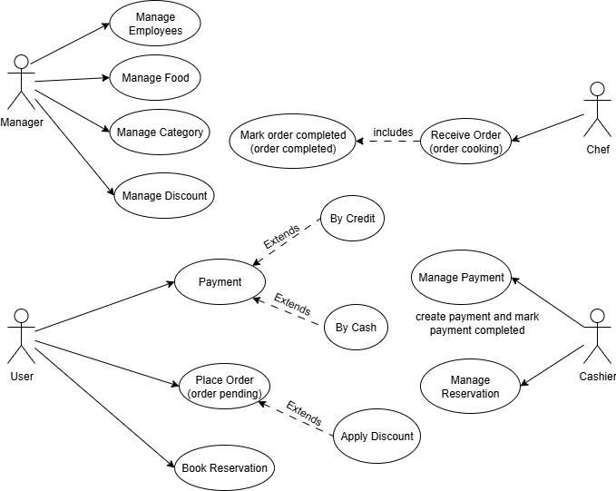

### Class Diagram
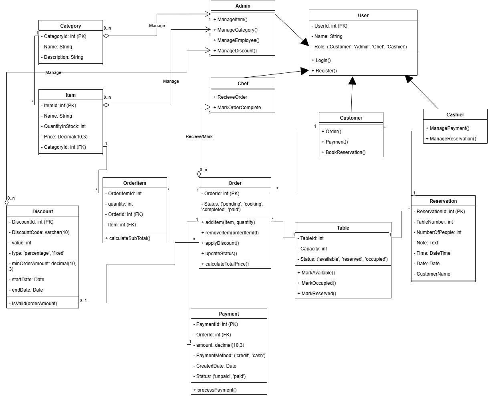

---

## User Interface

Below are screenshots of the POS system interface demonstrating the live client screens for customers, cashiers, kitchen staff, and management:

### 🛒 Ordering & POS Screen
* **POS Checkout Dashboard**: Interface where staff/customers select menu items, view the current cart, and submit orders.
  
  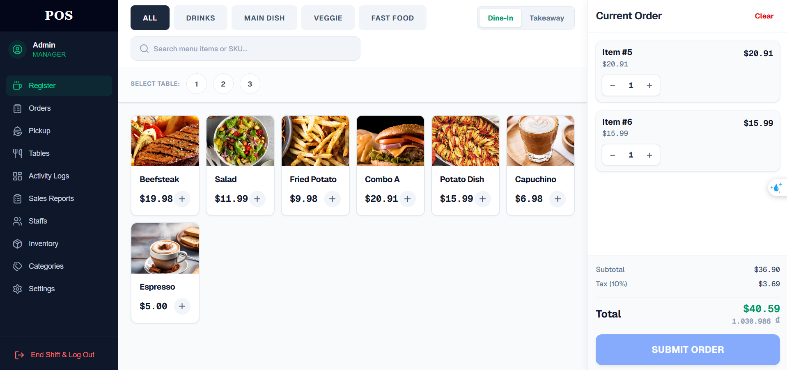

### 🍳 Live Kitchen & Pickup Displays
* **Kitchen Display System (KDS)**: Live queue where chefs track pending tickets, update preparation states (Pending → Cooking → Ready), and view items.
  
  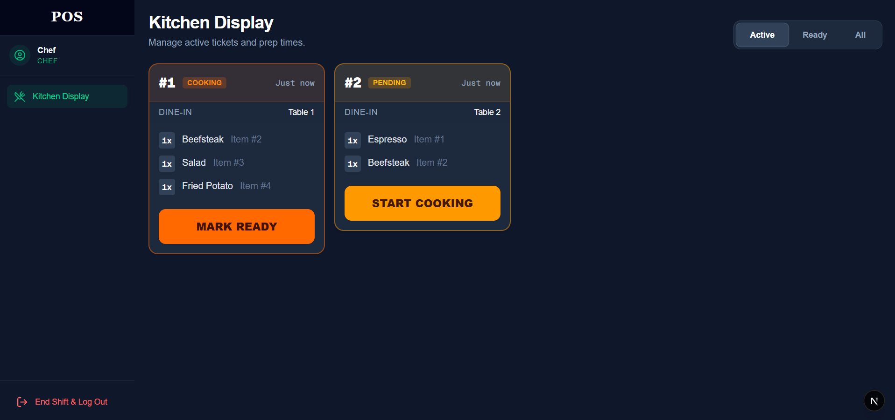

* **Service Pickup Board**: Screen for servers/waiters to monitor orders marked as "Ready for Pickup" and mark them as served.
  
  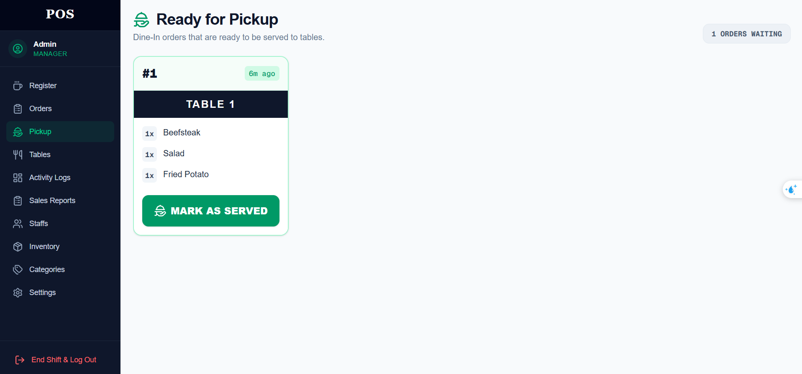

### 📊 Management & Admin Dashboards
* **Order History & Status Manager**: Main console to review active, paid, completed, and cancelled order details.
  
  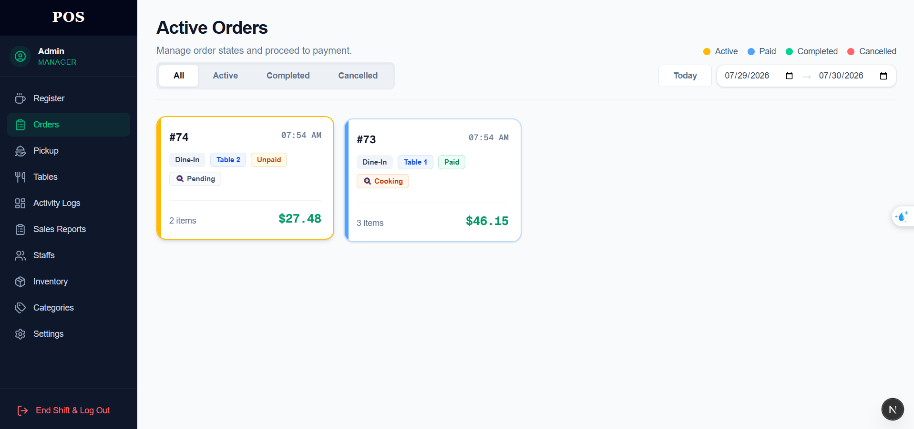

* **Sales Analytics & Reports**: Dashboard displaying hourly transaction breakdowns and aggregated revenue reports.
  
  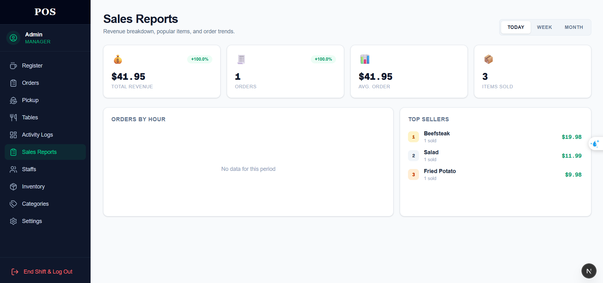

* **Inventory & Menu Catalog Management**: Core console for adding, modifying, and assigning catalog items.
  
  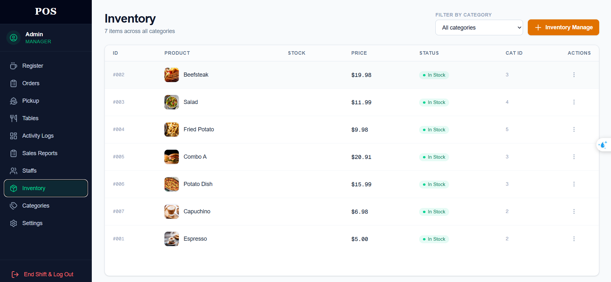

* **Category Controls**: Panel to add and organize menu collections.
  
  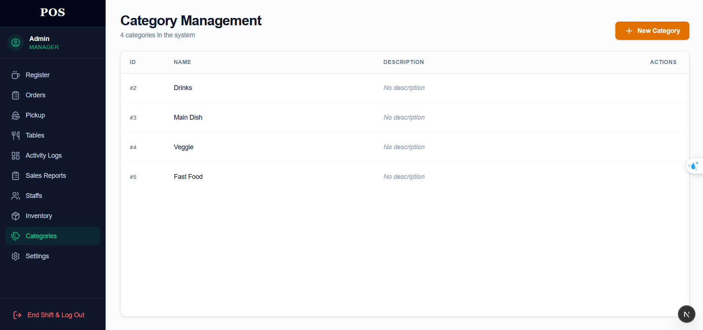

* **Table Management Dashboard**: Interface showing layout status (Occupied, Reserved, Available) and active table details.
  
  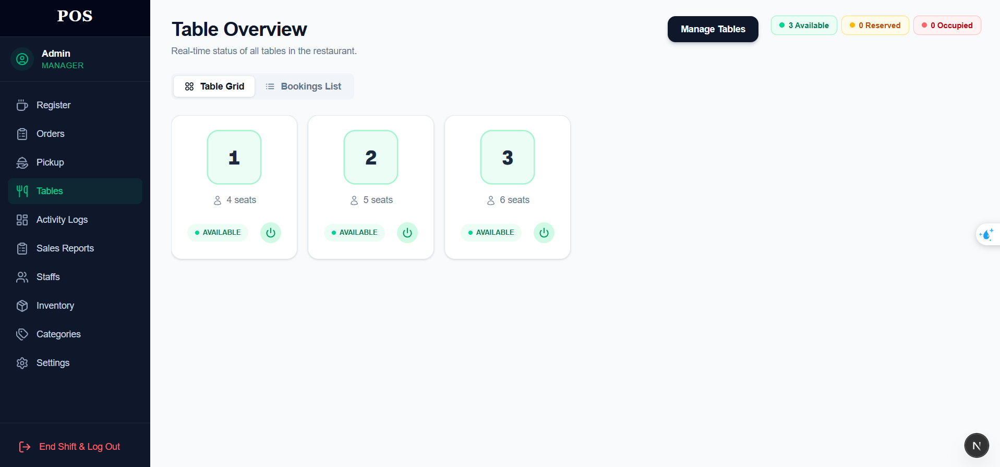

* **Staff Registry**: Panel for managing workers and assigning access roles.
  
  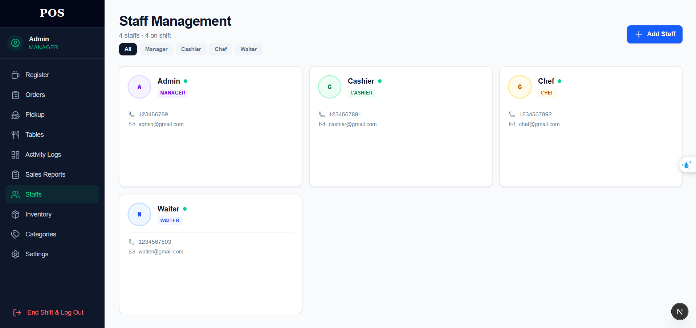

* **Audit Log Board**: Real-time audit trails capturing CRUD actions and changes to database entities via EF Core interceptors.
  
  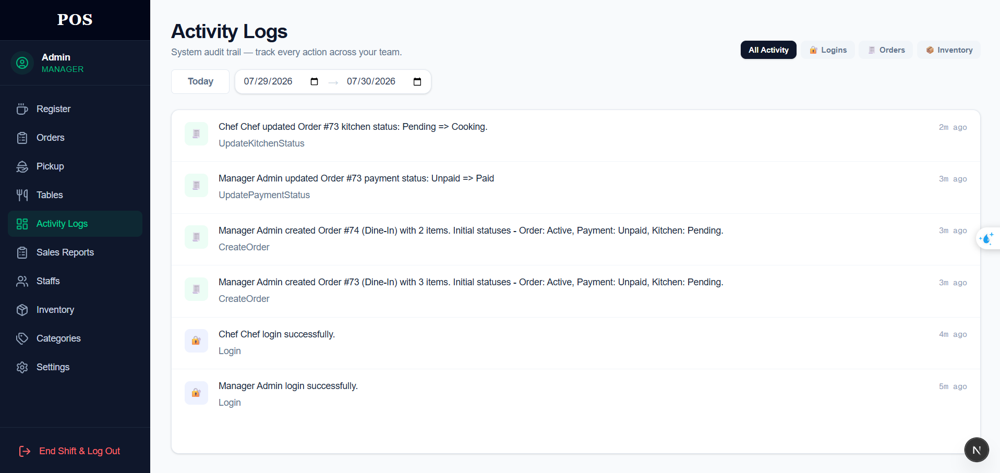

---

## Architecture

The system follows **Clean Architecture** with a strict separation of concerns across four layers:

```
CSW306_ProjectAPI/
├── CSW306.Domain/           # Entities, enums, domain logic
├── CSW306.Application/      # Interfaces, DTOs, service contracts
├── CSW306.Infrastructure/   # EF Core, Redis, Cloudinary, repositories
└── CSW306_ProjectAPI/       # ASP.NET Core controllers, SignalR hubs, middleware
```

The **Next.js** frontend lives in the `client/` directory and communicates with the API via Axios and SignalR.

---

## Tech Stack

### Backend
| Layer | Technology |
|-------|-----------|
| Framework | ASP.NET Core 8 Web API |
| ORM | Entity Framework Core |
| Database | PostgreSQL |
| Cache | Redis (StackExchange.Redis) |
| Real-time | SignalR (`/hubs/pos`) |
| Auth | JWT Bearer Tokens |
| File Storage | Cloudinary |
| API Docs | Swagger / OpenAPI |
| Containerization | Docker |

### Frontend
| Layer | Technology |
|-------|-----------|
| Framework | Next.js 16 (App Router) |
| Language | TypeScript |
| UI | Tailwind CSS v4 · Lucide Icons |
| State | Zustand |
| Server State | TanStack React Query v5 |
| Real-time | Microsoft SignalR Client |
| HTTP Client | Axios |
| Notifications | React Hot Toast |

---

## Features

### 👤 Authentication & Authorization
- JWT-based authentication with configurable expiry
- Role-based access control: **Admin**, **Cashier**, **Chef**, **Customer**
- Separate registration flows for customers and staff

### 🛒 Order Management
- Create and manage orders in real time
- Order status lifecycle: Pending → Confirmed → Preparing → Ready → Completed
- Automatic order cleanup via background sweeper service
- Date-range filtering for order history

### 💳 Payment Processing
- QR code payment via VietQR integration
- Payment transaction logging to prevent double-charging
- Partial payment detection with real-time UI warnings (SignalR)
- Discount application on orders

### 🍳 Kitchen Display System (KDS)
- Live order queue for kitchen staff
- Real-time updates pushed via SignalR hub

### 🪑 Table & Reservation Management
- Full CRUD for restaurant tables
- Reservation management with status lifecycle

### 📦 Inventory & Menu Management
- Item and category management
- Image upload to Cloudinary
- Assign items to categories

### 📊 Manager Dashboard
- Sales reports with dynamic date-range filtering
- Hourly sales metrics aggregation
- Staff management
- Activity logs with Redis write-back caching strategy

---

## API Reference

### Authentication
| Method | Endpoint | Description |
|--------|----------|-------------|
| `POST` | `/api/Auths/customer/register` | Register as a customer |
| `POST` | `/api/Auths/employee/register` | Register as a staff member |
| `POST` | `/api/Auths/login` | Login and receive JWT token |

### Users
| Method | Endpoint | Description |
|--------|----------|-------------|
| `GET` | `/api/User` | Get all users |
| `POST` | `/api/User` | Create a user |

### Items
| Method | Endpoint | Description |
|--------|----------|-------------|
| `GET` | `/api/Items` | Get all menu items |
| `POST` | `/api/Items` | Create a menu item |

### Categories
| Method | Endpoint | Description |
|--------|----------|-------------|
| `GET` | `/api/Categories` | Get all categories |
| `GET` | `/api/Categories/{id}` | Get a category by ID |
| `POST` | `/api/Categories` | Create a category |
| `POST` | `/api/Categories/assign-item` | Assign an item to a category |

### Orders
| Method | Endpoint | Description |
|--------|----------|-------------|
| `GET` | `/api/Orders` | Get all orders |
| `GET` | `/api/Orders/{id}` | Get an order by ID |
| `GET` | `/api/Orders/filter_by_date_range` | Filter orders by date range |
| `POST` | `/api/Orders` | Create a new order |
| `PATCH` | `/api/Orders/{id}` | Update order status |

### Tables
| Method | Endpoint | Description |
|--------|----------|-------------|
| `GET` | `/api/Table` | Get all tables |
| `GET` | `/api/Table/{id}` | Get a table by ID |
| `POST` | `/api/Table` | Create a table |
| `PUT` | `/api/Table/{id}` | Update table status |
| `DELETE` | `/api/Table/{id}` | Delete a table |

### Reservations
| Method | Endpoint | Description |
|--------|----------|-------------|
| `GET` | `/api/Reservation` | Get all reservations |
| `GET` | `/api/Reservation/{id}` | Get a reservation by ID |
| `POST` | `/api/Reservation` | Create a reservation |
| `PUT` | `/api/Reservation/{id}` | Update reservation status |
| `DELETE` | `/api/Reservation/{id}` | Delete a reservation |

### Discounts
| Method | Endpoint | Description |
|--------|----------|-------------|
| `GET` | `/api/Discounts` | Get all discounts |
| `GET` | `/api/Discounts/{id}` | Get a discount by ID |
| `POST` | `/api/Discounts/add` | Create a discount |
| `POST` | `/api/Discounts/apply/{id}` | Apply a discount to an order |
| `PUT` | `/api/Discounts/edit/{id}` | Update a discount |
| `DELETE` | `/api/Discounts/delete/{id}` | Delete a discount |

### Payments
| Method | Endpoint | Description |
|--------|----------|-------------|
| `GET` | `/api/Payments` | Get all payments |
| `GET` | `/api/Payments/{id}` | Get a payment by ID |
| `POST` | `/api/Payments/add` | Create a payment record |
| `POST` | `/api/Payments/pay/{id}` | Process a payment |
| `PUT` | `/api/Payments/edit/{id}` | Update a payment |
| `DELETE` | `/api/Payments/delete/{id}` | Delete a payment |

### Sales Reports
| Method | Endpoint | Description |
|--------|----------|-------------|
| `GET` | `/api/SalesReports` | Get aggregated sales reports |

### Activity Logs
| Method | Endpoint | Description |
|--------|----------|-------------|
| `GET` | `/api/ActivityLogs` | Get audit/activity logs |

### Real-time (SignalR)
| Hub | Endpoint |
|-----|----------|
| POS Hub | `/hubs/pos` |

---

## Getting Started

### Prerequisites

**Backend:**
- [.NET SDK 8.0](https://dotnet.microsoft.com/download)
- PostgreSQL (or connection string for a hosted instance)
- Redis (local or hosted)
- Visual Studio 2022 / VS Code / Rider

**Frontend:**
- Node.js 18+
- npm or yarn

---

### Backend Setup

**1. Clone the repository**
```bash
git clone https://github.com/O-VanTho-programmer/PointOfSaleSystem_ProjectAPI.git
cd CSW306_ProjectAPI/CSW306_ProjectAPI
```

**2. Configure `appsettings.json`**
```json
{
  "ConnectionStrings": {
    "DBConnection": "Host=localhost;Database=CSW306_ProjectAPI;Username=postgres;Password=yourpassword",
    "RedisCache": "localhost:6379"
  },
  "JwtSettings": {
    "SecretKey": "your-strong-secret-key-at-least-32-chars",
    "Issuer": "PointOfSale.AuthServer",
    "Audience": "PointOfSale.Client",
    "ExpiryMinutes": 60
  },
  "CloudinarySettings": {
    "CloudName": "your-cloud-name",
    "ApiKey": "your-api-key",
    "ApiSecret": "your-api-secret"
  }
}
```

**3. Apply database migrations & run**
```bash
dotnet restore
dotnet ef database update
dotnet run
```

The API will be available at `https://localhost:5000` with Swagger UI at `/swagger`.

---

### Frontend Setup

```bash
cd client
npm install
```

Create a `.env.local` file:
```env
NEXT_PUBLIC_API_URL=https://localhost:5000
NEXT_PUBLIC_SIGNALR_HUB_URL=https://localhost:5000/hubs/pos
```

Start the development server:
```bash
npm run dev
```

The frontend will be available at `http://localhost:3000`.

---

### 🐳 Docker (Backend)

```bash
cd CSW306_ProjectAPI
docker build -t pos-api .
docker run -p 8080:8080 pos-api
```

---

## 🗂️ Use Case to API Mapping

| Use Case | Role | Endpoint |
|----------|------|----------|
| Customer Registration | Public | `POST /api/Auths/customer/register` |
| Staff Login | All Staff | `POST /api/Auths/login` |
| Browse Menu | Cashier / Customer | `GET /api/Items` |
| Create Order | Cashier | `POST /api/Orders` |
| Update Order Status | Chef / Cashier | `PATCH /api/Orders/{id}` |
| Process Payment | Cashier | `POST /api/Payments/pay/{id}` |
| Reserve a Table | Cashier / Customer | `POST /api/Reservation` |
| View Sales Report | Manager | `GET /api/SalesReports` |
| Manage Inventory | Manager / Admin | `POST /api/Items` |

---

## 📁 Project Structure

```
.
├── CSW306_ProjectAPI/        # .NET Solution
│   ├── CSW306.Domain/        # Entities & enums
│   ├── CSW306.Application/   # Interfaces, services, DTOs
│   ├── CSW306.Infrastructure/# EF Core, Redis, Cloudinary
│   └── CSW306_ProjectAPI/    # Web API (controllers, hubs)
├── client/                   # Next.js frontend
│   ├── app/                  # App Router pages
│   │   ├── (cashier)/        # Cashier views (orders, register)
│   │   ├── (kitchen)/        # Kitchen Display System
│   │   └── (manager)/        # Manager dashboard
│   ├── components/           # Reusable UI components
│   ├── hooks/                # Custom React hooks (SignalR, queries)
│   ├── services/             # Axios API service layer
│   ├── store/                # Zustand global state
│   └── types/                # TypeScript type definitions
└── doc/                      # System diagrams
```
